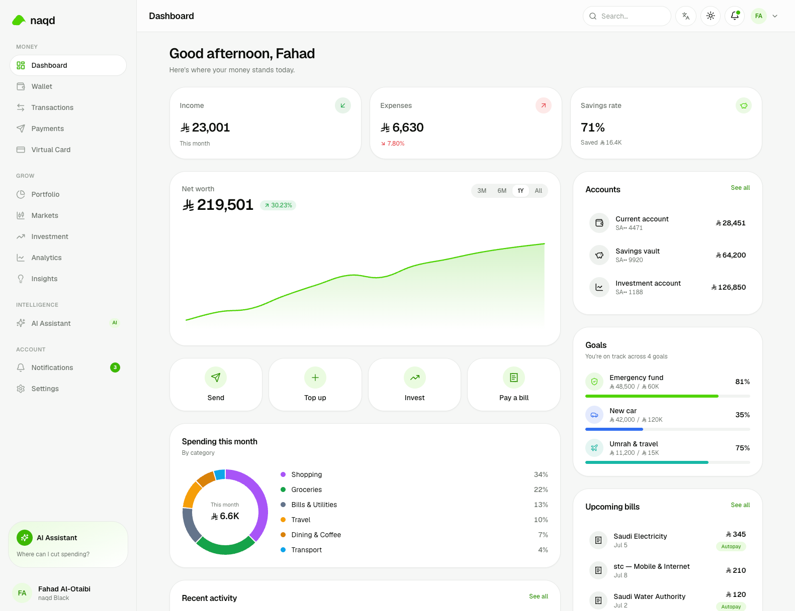

<div align="center">

# naqd · نقد

### The smartest way to spend, save, and grow your money — built for Saudi Arabia.

**Open banking, a digital wallet, and the stock market — together in one place.**
Fully bilingual (العربية / English), native right‑to‑left, and beautifully designed.

<br/>



</div>

---

## What is naqd?

naqd is a premium Saudi fintech experience that brings your everyday money, your
investments, and an AI money assistant into a single, elegant app. It feels less
like a prototype and more like a product getting ready to launch — every screen,
number, date, and chart adapts instantly between Arabic and English.

## Highlights for reviewers

- 🌍 **Truly bilingual, truly RTL** — switch between **العربية** and **English**
  instantly from anywhere. Layout mirrors, Arabic uses native Arabic‑Indic
  numerals, and typography is tuned per language. Not a translation — it feels
  native in both.
- 📈 **A live stock market** — trade **Saudi (Tadawul)** and **US** stocks side by
  side. Real company logos, prices that tick live, animated charts, search &
  filters, and one‑tap buy/sell that actually updates your holdings and cash.
- 🤖 **An AI assistant that knows your money** — ask about your spending, budgets,
  or whether you can afford something, and get clear answers in your language
  (powered by OpenRouter, with a graceful offline fallback).
- 💳 **A digital card, Apple‑Wallet style** — a stacked, tappable wallet with
  freeze, reveal details, spending controls, and Apple Pay.
- 📊 **Rich analytics & insights** — cash‑flow, spending breakdowns, net‑worth
  trends, and smart, personalized observations — all with custom, locale‑aware
  charts.
- 🎨 **Premium, Apple‑inspired design** — calm surfaces, thoughtful motion, light
  **and** dark modes, an animated hero, and a big‑typography footer.

## Take a tour

| | |
|---|---|
| **Dashboard** — net worth, spending, goals, quick actions | **Markets** — live Saudi + US trading |
| **Portfolio** — holdings, allocation, performance | **AI Assistant** — chat about your finances |
| **Virtual Card** — Apple‑Wallet‑style stack | **Wallet · Transactions · Payments** |
| **Analytics · Insights** — charts and observations | **Settings** — language, theme, security |

> Tip: open the app, then use the **language toggle** in the top bar to flip the
> entire experience between Arabic and English — and the **theme toggle** for dark
> mode.

## Try it locally

```bash
npm install
npm run dev        # open http://localhost:3000  (redirects to /en)
```

Then visit **`/ar`** for the Arabic, right‑to‑left experience — or just tap the
language switch in the app.

To enable the **live** AI assistant, add an OpenRouter API key (optional — the
assistant works with curated responses without it):

```bash
cp .env.example .env.local   # then set OPENROUTER_API_KEY
```

## Built with

**Next.js 15** (App Router) · **React 19** · **TypeScript** · **Tailwind CSS v4** ·
**next‑intl** (i18n) · custom **SVG charts** · **WebGL** backgrounds · **OpenRouter API**.

---

<div align="center">
<sub>naqd is a product demo built for evaluation — not a licensed financial institution.</sub>
</div>
